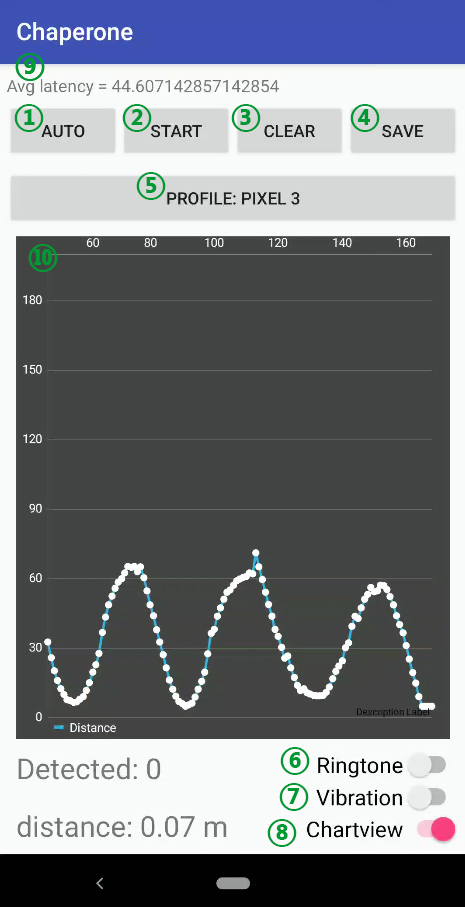

# Chaperone

Chaperone is a smartphone loss prevention solution based on active acoustic sensing.
It can detect the smartphone user's departure from the device and alert the user of
a potential smartphone loss.

The released code is a demo version of Chaperone derived from the one used in the user study of
the Usenix Security 2020 submission  *Chaperone: Real-time Locking and Loss Prevention
for Smartphones*. Note that it is slightly different from the user study version in the UI:
Ringtone and Vibration buttons were hidden from the user study participants in the user study version.

Chaperone is a standalone acoustic sensing app developed based on
LibAcousticSensing (LibAS) [https://github.com/yctung/LibAcousticSensing].
We use a pre-compiled library under the ```libacousticsensing``` directory.

## Requirements

- Operating system: Android 7.0 and later (Older versions require a different LibAS library)

Due the hardware difference, Chaperone for different smartphone models need a manual
tuning process. The demo version of Chaperone is basically tuned for Google Pixel (2015).
We also tested Chaperone and provide the support for the following models:

- Nexus 5x, 6p (Compatible with the Google Pixel profile)
- Google Pixel 3
- Samsung Galaxy S8
- Huawei AL-10

Note: Nexus 5x, 6p and Google Pixel share the same profile. 

- Please do not run the compiled app on virtual devices.

## Building

The application can be built using Android Studio and Gradle. If you have
your own compiled LibAS library (```.aar```), you can put it
under```libacousticsensing``` folder and replace the ```.aar``` file with
the same filename.

## Main UI

The Chaperone demo contains only one activity and does not run as a service.
As a demo app, it is designed to show how our device prevention solution works
and display real-time user trace for reference. The following screenshot shows
the main activity of Chaperone demo.



1. **AUTO/MANUAL:** to enable or disable acceleration based trigger module of Chaperone. When you
   click "AUTO", Chaperone will decide when to start and end acoustic sensing by itself. When
   you click "MANUAL", you have to manually start the acoustic sensing.

2. **START/STOP:** to start or stop acoustic sensing.

3. **CLEAR:** to clear the real-time display and all history information.


4. **SAVE:** to save the current trace to a file.


5. **PROFILE:** to select a profile for your device.


6. **Ringtone:** to enable or disable ringtone as an alert method.


7. **Vibration:** to enable or disable vibration as an alert method.


8. **Chartview:** to enable or disable real-time trace display.


9. **Log:** to display debug or error information.

10. **Real-time display:** to display the real-time trace of the smartphone user.
"Detected" field shows how many potential departure events Chaperone captured.
"distance" field shows the current estimated distance between the user and the device.


## Quick start

- Step 1: Choose the right profile for your device.

- Step 2 (Optional): Select the alert method and enable the Chartview.

- Step 3: Put down your device and press either "AUTO" or "START" to start acoustic sensing.

- Step 4: Perform some movement and you can observe the real-time distance.

- Step 5: Press "MANUAL" or  "STOP " to end acoustic sensing.

- Step 6: Press "SAVE" to save the raw data.


## Toubleshooting

- Debug field shows "Init. fails" or Distance field never changes: It means it cannot find the preamble and conduct acoustic sensing at this moment.
  It usually happens when you manually start the acoustic sensing. Just try to restart
  it until it works. If it fails several times, please check if your device is supported
  and if the speaker and the microphone of your phone are available.

- Failed to start acoustic sensing: please make sure that the phone is not under "Do Not Disturb" mode and try again. 


## License
MIT License
